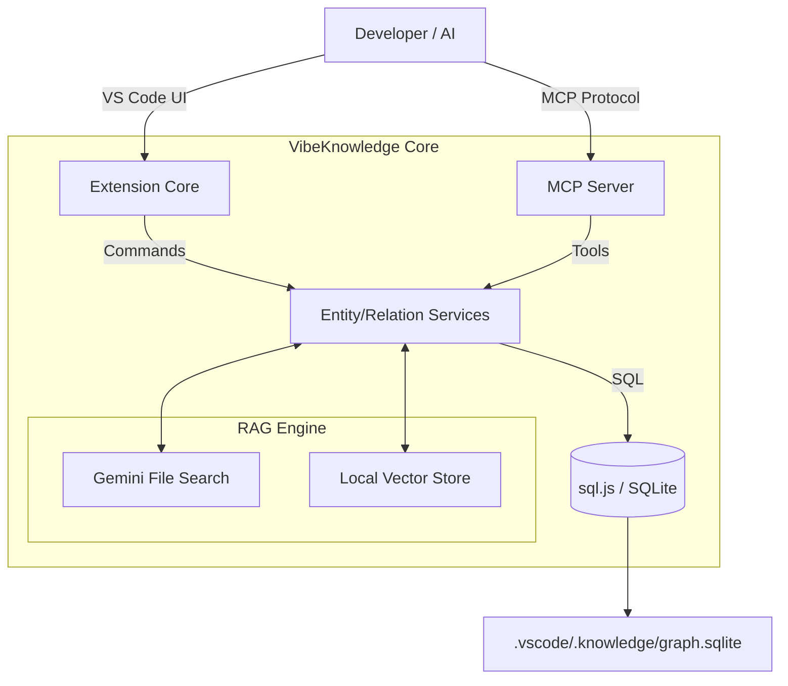

# VibeKnowledge - VS Code Knowledge Graph Extension

> Transform your codebase into an intelligent knowledge network for more efficient AI programming.


## # Theme

**Vibe Coding: Intelligent Context Middleware**

VibeKnowledge focuses on turning AI pair programming into a reliable "super middleware" that bridges human intent and model capabilities. By transforming codebases into structured knowledge graphs, we create a persistent memory layer that allows AI to "vibe" with your project's specific context, architectural decisions, and constraints, rather than just reading raw text files.

## # Problem Statement

In the current AI-assisted development workflow, developers face significant friction:

1.  **Context Amnesia**: AI assistants lose project context between sessions, forcing developers to write repetitive, lengthy prompts to "prime" the model.
2.  **Opaque Decision Making**: When AI generates code, it often lacks traceability to architectural patterns or previous design decisions (ADRs), leading to technical debt.
3.  **Fragmented Toolchains**: Non-technical stakeholders struggle to participate in the development lifecycle because the logic is buried in code, not exposed in an understandable format.
4.  **Hallucination Risks**: Without a grounded "truth" (knowledge graph), AI models tend to hallucinate APIs or import non-existent dependencies.

**VibeKnowledge solves this by creating a persistent, queryable "Second Brain" for your code within VS Code.**

## # Key Features Implemented

### 1. Intelligent Knowledge Graph System
*   **Entity Management**: Precision mapping of code elements (Functions, Classes, APIs) to file locations.
*   **Semantic Relations**: Define rich relationships (`uses`, `calls`, `extends`, `depends_on`) to model system architecture.
*   **Observations**: Attach persistent notes, warnings, and design decisions directly to code nodes.
*   **Interactive Visualization**: Full interactive graph based on `vis-network` with auto-layout and circular dependency detection.

### 2. Model Context Protocol (MCP) Integration
*   **MCP Server**: Built-in MCP server that exposes the knowledge graph to **Cursor** and **GitHub Copilot**.
*   **Context Tools**:
    *   `search_entities` / `search_observations`: Fuzzy search across the graph.
    *   `knowledge://relations`: Query dependency chains.
    *   `ask_question`: RAG-based Q&A tool.

### 3. Dual-Mode RAG (Retrieval-Augmented Generation)
*   **Cloud Mode (Google Gemini)**: Zero-config, managed file search with massive context window support. Supports 100+ formats (PDF, DOCX, MD).
*   **Local Mode (Privacy-First)**: Fully local RAG using OpenAI-compatible endpoints (e.g., Ollama). Runs entirely on-device with zero external dependencies using `sql.js` and local vector stores.
*   **Incremental Indexing**: Smart monitoring of the `Knowledge/` folder to only process new or changed documents.

### 4. AI Collaboration Suite
*   **Context Export**: One-click generation of `.cursorrules` and `.github/copilot-instructions.md`.
*   **Dependency Analysis**: Recursive dependency tree building to help AI understand impact radius.
*   **Multi-Language Support**: Full i18n support for English and Chinese.

## # Technical Design & Architecture

### System Architecture

The extension is built as a standalone ecosystem that requires no external database servers.



### Technology Stack

| Component | Technology | Reason for Choice |
|-----------|------------|-------------------|
| **Runtime** | Node.js / TypeScript | Type safety and VS Code native integration. |
| **Storage** | `sql.js` (WASM SQLite) | **Zero-dependency**, cross-platform compatibility (Win/Mac/Linux), single-file portability. |
| **Protocol** | Model Context Protocol (MCP) | Standardized interface for AI clients (Cursor/Copilot) to query the graph. |
| **Visualization** | `vis-network` | High-performance rendering for interactive graph exploration. |
| **RAG** | Gemini API / OpenAI Compat | Flexible choice between managed power (Gemini) and total privacy (Local). |

### Database Schema Design

We use a relational schema to ensure strict data integrity for the knowledge graph.

```sql
-- Entities: The nodes of the graph
CREATE TABLE entities (
    id TEXT PRIMARY KEY,
    name TEXT NOT NULL,
    type TEXT NOT NULL, -- Function, Class, Service, etc.
    file_path TEXT NOT NULL,
    description TEXT
);

-- Relations: The edges of the graph
CREATE TABLE relations (
    source_entity_id TEXT NOT NULL,
    target_entity_id TEXT NOT NULL,
    verb TEXT NOT NULL -- uses, calls, extends
);
```

---

## 🚀 Quick Start

### Installation

```bash
# 1. Clone repository
git clone https://github.com/yourusername/vibecoding.git
cd vibecoding

# 2. Install dependencies
npm install

# 3. Compile & Run
npm run compile
# Press F5 in VS Code to launch the Extension Development Host
```

### Basic Usage Flow

1.  **Create**: Select code in VS Code -> Right Click -> `Knowledge: Create Entity`.
2.  **Connect**: Select another piece of code -> `Knowledge: Link to Entity`.
3.  **Visualize**: Click the "Knowledge Graph" icon in the activity bar.
4.  **Chat**: Open Cursor/Copilot and ask: "What is the relationship between UserAuth and DatabaseService?" (requires MCP).

### RAG Configuration

**Option A: Cloud Mode (Gemini)**
1.  Get API Key from Google AI Studio.
2.  VS Code Settings -> `Knowledge Graph: Gemini Api Key`.
3.  Drop files into `root/Knowledge/` folder.

**Option B: Local Mode (Ollama/LocalAI)**
1.  VS Code Settings -> `Knowledge Graph: RAG Mode` -> `local`.
2.  Set API Base (e.g., `http://localhost:11434/v1`).
3.  Run Command: `Knowledge: Rebuild RAG Index`.

---

## 🔌 MCP Server Integration

This project ships with a standalone MCP server to power your AI editor.

**How it works:**
The MCP server reads the **same SQLite database** (`.vscode/.knowledge/graph.sqlite`) that the VS Code extension writes to. This ensures your AI always has the latest architectural view.

**Tools Provided:**
*   `knowledge://overview`: Stats on your project's knowledge base.
*   `search_entities`: Find code components by concept.
*   `ask_question`: Query the documentation/RAG store.

For detailed setup in Cursor, see [MCP Usage Guide](./MCP_USAGE.md).

---

## 📁 Project Structure

```
vibecoding/
├── src/
│   ├── services/          # Core Logic (Graph, RAG, MCP)
│   ├── providers/         # VS Code UI (TreeViews, Webviews)
│   ├── database.ts        # SQLite Connection Layer
│   └── i18n/              # Internationalization (EN/ZH)
├── .vscode/
│   └── .knowledge/        # Local Database Storage (Gitignored recommended)
└── Knowledge/             # User Documentation for RAG
```

## 📚 References

*   [VS Code Extension API](https://code.visualstudio.com/api)
*   [Model Context Protocol (MCP)](https://modelcontextprotocol.io/)
*   [Google Gemini API](https://ai.google.dev/)
*   [sql.js Documentation](https://sql.js.org/)
